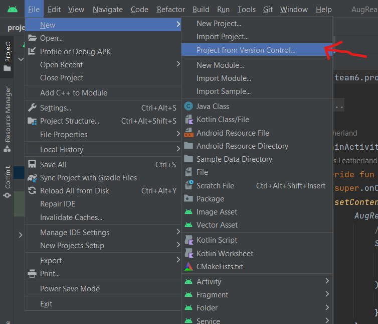

# Team6 Augmented Reality Artificially Intelligent Art

## Overview:
The aim of this project is to create a mobile app which utilises Augmented Reality (AR) and IBM 
Watson to create a unique piece of interactive art and facilitate a richer art appreciation 
experience. We have created a painting, accompanying AR effects that can be viewed through our app, 
and an IBM Watson Assistant chatbot in the app that takes on the persona of the painting. 
The chatbot answers questions about the painting’s artist, content, and meaning, and also 
answers questions about how the chatbot works. IBM wanted us to develop this as a 
proof-of-concept product to demonstrate how people could be given a better way to connect to and 
understand the meaning behind pieces of art, whilst utilising this engaging medium to demystify
AI for the general public and bring awareness of IBM Watson.

## How to use:
To clone and run this application, you will need to install [Android studio](https://developer.android.com/studio?gclid=CjwKCAjwjMiiBhA4EiwAZe6jQ5tGfYxLxe7SqYGWqkqL7PdCm16dfKPIB2CjhbS3iIwxgcL4NH21nRoCz5oQAvD_BwE&gclsrc=aw.ds) on your computer and git.
_*note: you will need an Android device in order for this project to run
1. clone the repository
2. click on File-> New-> Project From Version Control
3. paste the repository link in the URL textfield
4. click clone and wait
5. click on Git in the toolbar and pull
6. wait for the project to completely install
7. follow this link to run the app on the [emulator](https://developer.android.com/studio/run/emulator)
   or connect an Android device with USB debugging (recommended)
   

## Built with:
- [Kotlin](https://kotlinlang.org/) 
- [Google ARCore library](https://developers.google.com/ar) 
- [Sceneform Sceneview Maintained](https://github.com/SceneView/sceneform-android)
- [IBM Watson Assistant](https://www.ibm.com/watson)

## Security:

We take the security and privacy of our users seriously. Our app uses your camera for detection.
We understand the sensitivity of using your camera and we want to assure you that we will 
never access or use your camera without your explicit consent.

When you first launch our app, you will be prompted to grant us permission to access your camera. 
If you grant us permission, your camera will only be used for the intended purpose and nothing else. 
We will not access or use your camera without your explicit consent. your camera data will not be
shared with any third-party services or partners. We take every measure to protect your 
data and ensure it is securely stored on your device.

## File structure:

The main project files are found in app/src/main/java/team6/project:

Backend files:
1. TextToSpeechInterface.java - Java class acting as the JavaScript Interface between the
   Chatbot WebView and the Text-to-speech service
2. StreamPlayer.java - Java class that converts and plays the Text-to-speech audio

Frontend files:
1. MainActivity.kt - Kotlin Activity class that is the entry point of the app, handles preloading
   the chatbot, camera permissions, and installing AR
2. PaintingWithArActivity.kt - Kotlin Activity class that handles the AR session, including
   detecting the painting and displaying the 3D AR animated model
3. PaintingNoArActivity.kt - Kotlin Activity class that handles the downgraded app experience for
   when AR is unavailable on the user's device, the user refuses to install AR, or they deny camera
   access
4. ChatbotActivity.kt - Kotlin Activity class that handles the Chatbot WebView which loads the
   chatbot.html file from the assets

Extras:

The IBM Watson Assistant html embed script (chatbot.html) is found in app/src/main/assets.
It connects to our IBM Watson Assistant instance and triggers the TextToSpeechInterface to play
its responses.

The layout file for the PaintingWithArActivity (activity_painting_with_ar.xml) is found in
app/src/main/res/layout.

An image of the painting (painting.jpg) is found in app/src/main/res/drawable. You can use it to
test the AR by pointing your camera at it.